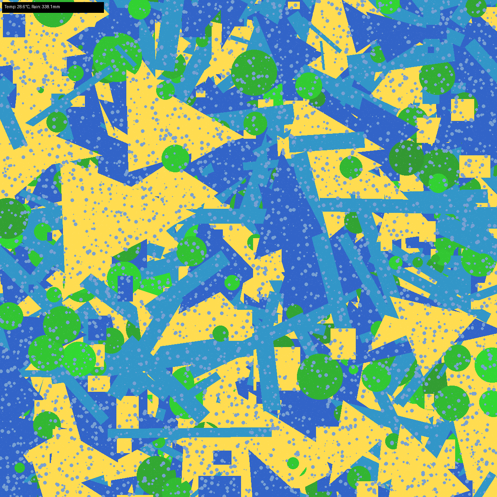

# Weather as Art 🌦️🎨

Turn weather data into simple abstract art. This project uses historical weather data (temperature and rainfall) to generate unique artwork based on the conditions of a specified month and year.

## 📖 Overview

Weather as Art is a Python-based application that:
- Loads historical weather data from a CSV file (`Temp_and_rain.csv`).
- Processes the data to extract average temperature and rainfall for a user-specified month and year.
- Generates abstract artwork using the Pillow library, where the visual elements (shapes, colors, and patterns) are influenced by the temperature and rainfall values.
- Displays the generated artwork and saves it as `artwork.png` in the current directory.

The project is structured into three main Python scripts:
- `data_processor.py`: Handles loading and processing of weather data.
- `art_generator.py`: Generates artwork based on temperature and rainfall.
- `main.py`: The main script that ties everything together and provides a user interface via the command line.

## 📂 Project Structure

```
Weather-as-Art/
│
├── src/
│   ├── art_generator.py     # Logic for generating artwork
│   ├── data_processor.py    # Logic for processing weather data
│   └── main.py              # Main script to run the application
│
├── data/
│   └── Temp_and_rain.csv    # Weather data file
│
├── README.md                # Project documentation
```

## 🚀 Getting Started

### Prerequisites
You need Python 3.6 or higher installed on your system. The following Python libraries are required:
- `pandas`: For data processing.
- `numpy`: For numerical operations.
- `Pillow` (PIL): For image generation and manipulation.

Install the dependencies using pip:

```command prompt
pip install pandas numpy Pillow
```

### Installation
1. Clone this repository to your local machine:
   ```command prompt
   git clone https://github.com/<your-username>/Weather-as-Art.git
   cd Weather-as-Art
   ```

2. Ensure the directory structure matches the one above. The `data/Temp_and_rain.csv` file should be present.

### Usage
1. Navigate to the project directory:
   ```command prompt
   cd Weather-as-Art
   ```

2. Run the main script:
   ```command prompt
   python src/main.py
   ```

3. Follow the prompts:
   - Enter a month (1-12).
   - Enter a year (between 1901 and the maximum year in the dataset).
   - The program will fetch the weather data for the specified month and year, generate artwork, and attempt to display it.
   - The generated artwork will be saved as `artwork.png` in the current directory.

   **Note**: If the image doesn't display automatically (e.g., due to platform limitations), you can find the saved image as `artwork.png` in the current directory.

4. To quit, enter `q` at any prompt.

### Example
```
===== WEATHER ART GENERATOR =====
   🌦️  WEATHER ART GENERATOR  🎨
       Turn weather data into beautiful art
====================================

Data available from 1901 to 1901

Enter 'q' at any prompt to quit
Enter month (1-12): 6
Enter year (1901-1901): 1999

Fetching weather data for 7/1901...
          tem  Month  Year     rain
1181  28.5738      6  1999  338.123
📊 Average Temperature: 28.57°C, Average Rainfall: 338.12mm

🎨 Generating artwork based on weather data...
Generating artwork for temperature: 28.5738°C, rainfall: 338.123mm
Artwork generated successfully: artwork.png
✅ Artwork generated successfully!

Artwork saved as artwork.png


```

## 🎨 How It Works
- **Data**: The `Temp_and_rain.csv` file contains historical weather data with columns: `tem` (temperature in °C), `Month`, `Year`, and `rain` (rainfall in mm).
- **Processing**: The `data_processor.py` script loads the CSV file and extracts the average temperature and rainfall for the specified month and year.
- **Art Generation**: The `art_generator.py` script uses the temperature and rainfall values to influence the artwork:
  - **Temperature** determines the color palette and types of shapes:
    - `< 20°C`: Light blue/white hexagons and circles.
    - `20-25°C`: Darker blue flowers and grass-like shapes.
    - `25-30°C`: Blue and yellow triangles, rectangles, rivers, and leaves.
    - `30-40°C`: Orange/red squares and spiky shapes, with thunder shapes if rainfall is significant.
  - **Rainfall** affects the number of shapes, their sizes, and adds rain particles if significant.
- **Output**: The artwork is saved as `artwork.png` in the current directory and displayed if possible.
- **Note**: You can increase the variety in artwork generation by assigning different styles to each degree celsius instead of having one style assigned to a whole group of few degree celsius. You can also use a more detailed dataset along with it for diverse generation.

## 📊 Data Format
The `Temp_and_rain.csv` file should have the following columns:
- `tem`: Temperature in °C.
- `Month`: Month number (1-12).
- `Year`: Year (e.g., 1901).
- `rain`: Rainfall in mm.

Example:
```
tem,Month,Year,rain
16.976,1,1901,18.5356
19.9026,2,1901,16.2548
...
```

## 🛠️ Troubleshooting
- **"File not found" error**: Ensure `data/Temp_and_rain.csv` exists in the `data/` directory.
- **"No data found for the given month and year"**: Check that the entered month and year exist in the CSV file.
- **Image not displaying**: Some systems may not support automatic image display. Check the current directory for the generated `artwork.png`.
- **Dependency issues**: Ensure all required libraries (`pandas`, `numpy`, `Pillow`) are installed.

## 🤝 Contributing
Contributions are welcome. If you'd like to contribute:
1. Fork this repository.
2. Create a new branch (`git checkout -b feature/your-feature`).
3. Make your changes.
4. Commit your changes (`git commit -m "Add your feature"`).
5. Push to the branch (`git push origin feature/your-feature`).
6. Open a pull request.
